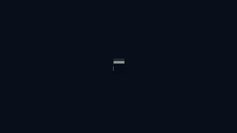

<h1 align="center">a C++ Raytracer</h1>  

a very compressed webp to give an idea of whats possible with a bit of scripting, a nicer mp4 can be found in `misc/`

setup and rendering of the animation can be done with running `./setup_and_anim.sh` in the root directory. the initial compiling could take some time and the rendering will take a _very_ long time, especially if you render it with a higher resolution/aa which can be set in the file `source/animation.sdf` along with the materials you want to use.

of course you can also render custom scenes you created in the `.sdf` format and alter `source/scene_load.cpp` to load your scene. it supports refelection, refraction, phong-shading and transprarency. objects can be shperes or cubes which can be transformed/translated.